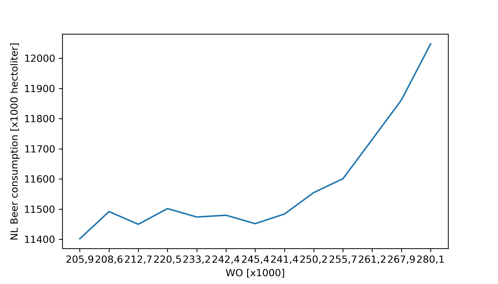

Fantastic yeasts and where to find them: the hidden diversity of dimorphic fungal pathogens, MCC Van Dyke et al., 2019

An analysis of the forces required to drag sheep over various surfaces, JT Harvey, Applied Ergonomics, 2002

The neurocognitive effects of alcohol on adolescents and college students, DW Ziegler et al., 2005



```python
import numpy as np
import pandas as pd
import matplotlib.pyplot as plt

df = pd.read_csv('istherecorrelation.csv', sep = ';')

plt.figure(figsize=(7,4)) 
plt.plot(df['WO [x1000]'], df['NL Beer consumption [x1000 hectoliter]'])
plt.xlabel('WO [x1000]')
plt.ylabel('NL Beer consumption [x1000 hectoliter]')
plt.savefig('file.jpeg', dpi=300)
```